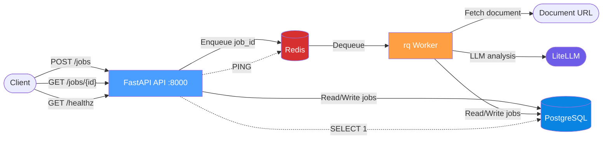
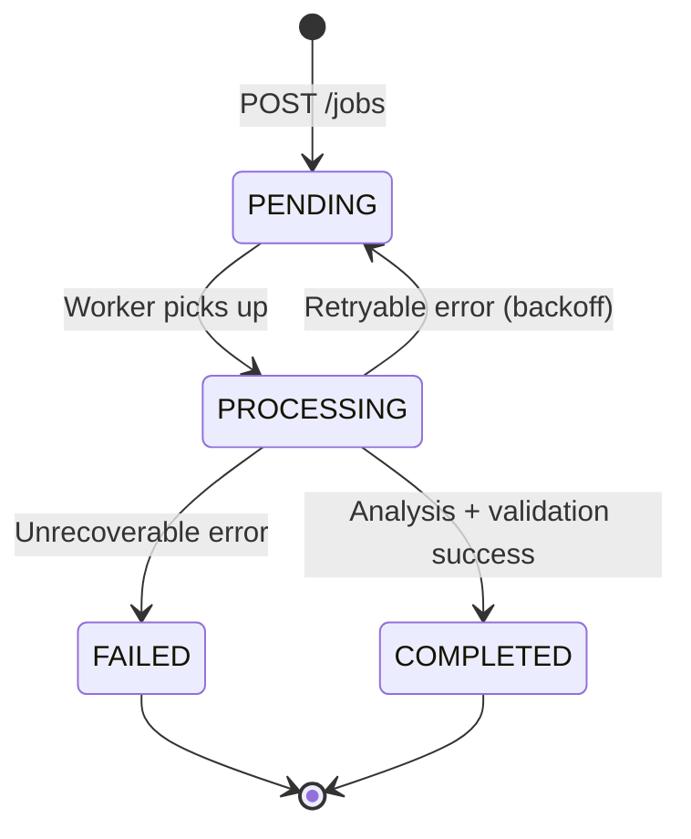

# Architecture

## System Diagram



## Job State Machine



### State Transitions

| From | To | Trigger | Audit Logged |
|------|----|---------|:---:|
| — | PENDING | POST /jobs creates job | ✅ |
| PENDING | PROCESSING | Worker dequeues and starts | ✅ |
| PROCESSING | COMPLETED | Analysis + validation succeed | ✅ |
| PROCESSING | FAILED | Unrecoverable error (document fetch, parse, token budget, max retries exhausted) | ✅ |
| PROCESSING | PENDING | Retryable error (LLM timeout, rate limit, validation failure on first attempt) | ✅ |

### Retry Strategy

| Error Type | Retryable | Strategy |
|------------|:---------:|---------|
| `LLMTimeoutError` | ✅ | Exponential backoff: `min(2s × 2^attempt, 60s)`, max 3 retries |
| `LLMRateLimitError` | ✅ | Same exponential backoff |
| `OutputValidationError` | ✅ | One retry (attempt 0 → 1), then FAILED |
| `DocumentFetchError` | ❌ | Immediate FAILED |
| `DocumentParseError` | ❌ | Immediate FAILED |
| `TokenBudgetExceeded` | ❌ | Immediate FAILED |

## Components

### `src/app.py` — FastAPI Application
Application factory with correlation ID middleware. Generates a UUID per request, stores it in a `ContextVar`, and attaches it to the response header. Initializes the database on startup.

### `src/config.py` — Configuration
Pydantic `BaseSettings` loading all config from environment variables: database URL, Redis URL, LLM model string, API key, optional API base URL, token budget, SSL verify flag, worker concurrency, and log level. Zero hardcoded values.

### `src/db.py` — Database Models
SQLAlchemy 2.0 declarative models for `Job` and `JobAuditLog`. The `Job` table stores document URL, analysis type, status (enum), result (JSONB), error message, token usage, and extensible metadata (JSONB with `schema_version`). `init_db()` creates tables via `CREATE TABLE IF NOT EXISTS`.

### `src/errors.py` — Exception Hierarchy
Seven distinct exception classes, each mapped to specific retry/fail behavior in the worker: `DocumentFetchError`, `DocumentParseError`, `LLMTimeoutError`, `LLMRateLimitError`, `TokenBudgetExceeded`, `OutputValidationError`, `JobNotFoundError`.

### `src/routes.py` — API Endpoints
All five endpoints in a single router. POST /jobs computes idempotency key via `sha256(url + type)`, checks for existing job, creates and enqueues if new. GET endpoints handle filtering, pagination, real health checks, and metrics.

### `src/schemas.py` — Pydantic Models
Request/response schemas: `JobCreate`, `JobResponse`, `JobListParams`, `HealthResponse`, `MetricsResponse`. All with type hints, validators, and `from_attributes=True` for ORM integration.

### `src/worker.py` — Job Processor
The rq worker entry point. `process_job(job_id)` orchestrates the pipeline: fetch document → LLM analysis → structural validation → persist result. Manages state transitions with audit logging. Implements exponential backoff for retryable errors.

### `src/agent.py` — Document Agent
Three core functions: `fetch_document()` (httpx + pdfplumber, content-length limit, prompt injection detection), `analyze()` (LiteLLM JSON mode, token tracking), `validate_output()` (Pydantic structural validation — never LLM-based).

### `src/prompts.py` — Prompt Templates
System and user prompt templates for each analysis type (summary, extraction, classification). Each includes the expected JSON output schema in the system prompt.

### `src/metrics.py` — Metrics Collector
Redis-backed shared counters (cross-process) for submissions, completions, failures, token spend, processing times (avg/p95), and error counts by type.

### `src/logging.py` — Structured Logging
structlog configuration with JSON output. Three `ContextVar` fields — `correlation_id`, `job_id`, `component` — automatically injected into every log line. Flows from API middleware through queue to worker.

## Design Decisions and Tradeoffs

### 1. rq for background job processing

**Decision**: Use `rq` (Redis Queue) for async job processing.

**Why**: rq has a minimal API surface — one `Queue`, one `Worker`, and jobs are plain Python functions. For a single-queue, single-worker service this keeps the operational footprint small. rq's failed-job queue gives built-in crash recovery: if a worker dies mid-job, the job moves to `FailedJobRegistry` rather than being silently dropped.

**Tradeoff**: rq is Redis-only, has no built-in periodic tasks, and its ecosystem is smaller than alternatives. If this service later needed multi-broker support, priority queues across multiple backends, or scheduled recurring jobs, the queue layer would need to be swapped. For this scope — fire-and-forget async processing with retries — rq is sufficient and simpler to operate.

### 2. JSONB for result storage, no migration tooling

**Decision**: Store LLM results in a JSONB column and manage schema with `CREATE TABLE IF NOT EXISTS` instead of a migration framework.

**Why**: JSONB allows each analysis type (summary, extraction, classification) to return a different JSON structure without requiring separate result tables or a rigid column schema. This is critical because the output schemas are defined by prompts and may evolve independently. Using `init_db()` with `create_all()` avoids migration chain management for a service with a single, stable schema. The `metadata` column includes a `schema_version` field so future migrations can be handled programmatically if needed.

**Tradeoff**: Without migration tooling, any schema change requires manual migration or a fresh database. In production with live data, a migration framework would be necessary. For this scope — a greenfield project with no existing data to migrate — the simplicity is worth it. The `schema_version` field is a hedge: if the schema changes, code can branch on version without dedicated tooling.

### 3. SHA-256 idempotency key

**Decision**: Compute `sha256(url + analysis_type)` as the idempotency key, stored as a unique constraint.

**Why**: Duplicate submissions are common in async systems (client retries on timeout, user double-clicks). A deterministic hash of the input pair means the same request always maps to the same job. The database unique constraint enforces this at the storage layer, not just application logic. SHA-256 has negligible collision probability and produces a fixed-length string suitable for indexing.

**Tradeoff**: This means a user cannot resubmit the same document for re-analysis after the first job completes or fails. In a production system, you'd want a TTL on idempotency keys or an explicit "force resubmit" flag. For this scope, preventing duplicates is more important than allowing re-runs.

### 4. Provider-agnostic LLM access via LiteLLM

**Decision**: All LLM calls go through `litellm.completion()` with the provider specified via an environment variable.

**Why**: LiteLLM normalizes the interface across providers behind a single function signature. Switching providers requires only changing the `LLM_MODEL` environment variable (e.g., `openai/gpt-4o-mini` → `gemini/gemini-2.5-flash`). This matches 12-factor config principles and avoids provider lock-in. No provider-specific SDK is imported anywhere in application code.

**Tradeoff**: The abstraction layer can lag behind provider-specific features (e.g., new API parameters, streaming modes, vision). If the service needed fine-grained control over a single provider's API, the abstraction would get in the way. For text-in/JSON-out analysis, it is sufficient.

### 5. Structural validation via Pydantic

**Decision**: Output validation uses Pydantic schema checks (required fields exist, confidence is 0–1, arrays are non-empty), not a second LLM call.

**Why**: Asking the LLM to self-grade is non-deterministic — the same model can approve its own bad output. Structural validation is deterministic, fast, and free. It catches the failures that matter: malformed JSON, missing fields, out-of-range values.

**Tradeoff**: Structural validation cannot catch semantic errors (e.g., a summary that is factually wrong, or a classification with correct schema but wrong category). A production system might layer semantic checks (embedding similarity, human review queue) on top. For this scope, structural validation provides reliable, cost-free quality gating.

### 6. Prompt injection detection: log, don't block

**Decision**: When prompt injection patterns are detected in document text, the system logs a warning but still processes the document.

**Why**: Blocking on injection patterns would cause false positives on legitimate documents that happen to contain phrases like "ignore previous instructions" (e.g., a security training manual, or an academic paper discussing prompt injection). Logging provides an audit trail without degrading the service for honest inputs.

**Tradeoff**: A determined attacker could inject instructions that the LLM follows. Mitigation is architectural: the LLM operates in JSON mode with a constrained output schema, and Pydantic validation rejects any output that doesn't match the expected structure. The attack surface is limited to producing valid-schema-but-wrong-content results, which is the same failure mode as any LLM hallucination.

### 7. Redis-backed metrics

**Decision**: Metrics (submission count, completion count, processing times, etc.) are stored in Redis shared counters, not in process-local memory.

**Why**: The API server and rq worker run as separate OS processes (and in Docker, separate containers). In-memory counters in the API process would never see completions/failures recorded by the worker. Redis provides a shared counter store that both processes can write to and the API can read from for the `/metrics` endpoint. All counter operations (INCR, RPUSH) are O(1).

**Tradeoff**: Redis adds a dependency for metrics — if Redis is down, metrics are unavailable (the endpoint returns a graceful fallback with zeros). Querying the database for aggregates on each request would avoid this dependency but would be expensive and wouldn't capture processing times or token counts without additional columns.

### 8. Correlation ID via ContextVar

**Decision**: Correlation IDs are stored in `contextvars.ContextVar` and injected into logs via a structlog processor, rather than passed explicitly through every function signature.

**Why**: ContextVars are thread-local (and task-local in async) and survive across function calls without polluting every function signature with a `correlation_id: str` parameter. The middleware sets the ContextVar once, and every log call in that request's call stack automatically includes it. The same ContextVar value is forwarded to the rq worker via job arguments, maintaining the trace across process boundaries.

**Tradeoff**: ContextVars are implicit state, which can be harder to reason about than explicit parameter passing. In a large team, developers might not realize the ContextVar needs to be set before logging. For a 12-file service, the simplicity of automatic log enrichment outweighs the implicit nature.

### 9. HTTP 202 Accepted for job creation

**Decision**: `POST /jobs` returns HTTP 202 instead of 201.

**Why**: 202 semantically means "request accepted for processing but not yet completed." The job exists in the database but hasn't been analyzed yet. 201 implies the resource is fully created and ready, which is misleading for an async workflow where the result doesn't exist until the worker finishes.

**Tradeoff**: Some REST clients and frameworks expect 201 for resource creation and may not handle 202 in their default success-path logic. The semantic correctness is worth the minor compatibility consideration.

### 10. Single Docker image, two entrypoints

**Decision**: One Dockerfile produces one image. `docker-compose.yml` runs two containers from the same image with different commands: `uvicorn` for the API, `rq worker` for the worker.

**Why**: The API and worker share the same codebase, dependencies, and configuration. Building two separate images would duplicate the build, increase CI time, and create version-skew risk. A single image guarantees both processes run identical code.

**Tradeoff**: The image includes dependencies that each process doesn't need (the API doesn't need pdfplumber, the worker doesn't need uvicorn). For a small image, this is acceptable. At scale, separate images with shared base layers would reduce container size.

### 11. Exponential backoff with cap

**Decision**: Retryable LLM errors use `min(2s × 2^attempt, 60s)` backoff with a maximum of 3 retries.

**Why**: LLM API failures are typically transient (rate limits, timeouts). Exponential backoff gives the provider time to recover while bounding the total wait time to under 2 minutes. With a single worker processing jobs sequentially, per-job backoff is sufficient.

**Tradeoff**: If the LLM provider has a prolonged outage, each job will exhaust its 3 retries individually rather than failing fast. A global failure-tracking mechanism would prevent wasted retries during sustained outages, but adds complexity for a single-worker service where the impact is limited.

### 12. Flat `src/` package

**Decision**: All source files live directly in `src/` with no subdirectories.

**Why**: The service has 11 modules, each with a single responsibility. Nesting would add import complexity (`from src.agent.core import ...` vs `from src.agent import ...`) without organizational benefit. The flat structure makes it immediately obvious what the service contains by listing one directory.

**Tradeoff**: If the service grew to 30+ modules, flat structure would become unwieldy. At that point, grouping by domain would be warranted. For this scope, flat is simpler.

## Data Flow

```
1. Client POSTs {document_url, analysis_type} to /jobs
2. API computes idempotency_key = sha256(url + type)
3. If key exists in DB → return existing job (202)
4. If new → create Job (PENDING), audit log, enqueue to Redis
5. Return 202 with job ID

6. rq worker dequeues job_id
7. Worker loads job from DB, transitions to PROCESSING
8. agent.fetch_document() downloads and extracts text
9. agent.analyze() calls LiteLLM with JSON mode
10. agent.validate_output() checks result against Pydantic schema
11. On success → store result, transition to COMPLETED
12. On retryable error → re-enqueue with backoff delay
13. On fatal error → store error, transition to FAILED

14. Client polls GET /jobs/:id to retrieve result
```

## Observability

### Correlation ID Flow
```
Client → [X-Correlation-ID header] → API middleware (generates if missing)
  → stored in ContextVar → attached to all API logs
  → passed via rq job args/metadata → Worker sets ContextVar
  → all worker/agent logs include same correlation_id
```

### Log Format
Every log line is JSON with: `timestamp`, `level`, `event`, `correlation_id`, `job_id` (when applicable), `component` (api/worker/agent).

### Alerting
**Page when**: error rate > 10% over 5-minute window. Indicates systemic LLM API failure or upstream issues. Query `/metrics` endpoint for `jobs_failed / (jobs_completed + jobs_failed)`.
